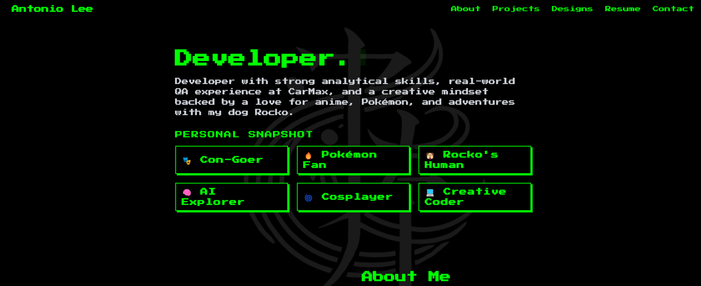

# 🧑‍💻 Antonio Lee – Developer Portfolio

Welcome to my personal developer portfolio built with **Next.js 14** and hosted on **Vercel**. This site showcases my favorite projects, unique design style, and passion for building creative, user-centered experiences.

🔗 **Live Site:** [antoniolee.vercel.app](https://antoniolee.vercel.app)

---

## ✨ Features

- 💬 **Typewriter Intro Animation**
- 🎰 **Slot Machine Scroll View** – creatively highlights one featured project at a time
- 🗂️ **Grid View Toggle** – browse projects quickly with a responsive card grid
- 🎮 **8-bit/Pixel Art Theme** – retro styling with Tailwind CSS and `Press Start 2P`
- 🖼️ **Animated Flip Cards** – hover effects reveal project details on card backs
- 💾 **GitHub Integration** – fetches real-time data via GitHub API
- 🐁 **Custom Green Retro Cursor**
- ⚡ Smooth transitions powered by Framer Motion
- 📱 Fully responsive on mobile, tablet, and desktop
- 🧠 **Project Filtering (Coming Soon)** – filter projects by language, stack, or type

---

## 🛠️ Tech Stack

| Tool            | Purpose                        |
|-----------------|--------------------------------|
| [Next.js](https://nextjs.org/)         | React-based framework              |
| [Tailwind CSS](https://tailwindcss.com/) | Utility-first CSS styling          |
| [Framer Motion](https://www.framer.com/motion/) | Animation & transitions            |
| [Vercel](https://vercel.com/)          | Hosting & continuous deployment    |
| [GitHub API](https://docs.github.com/en/rest)   | Dynamic project data               |
| [Google Fonts – Press Start 2P](https://fonts.google.com/specimen/Press+Start+2P) | Retro font styling |

---

## 🧩 Local Setup

To run the project locally:

```bash
# Clone the Repo
git clone https://github.com/yourusername/your-portfolio.git

# Change directory to the project
cd your-portfolio

# Install dependencies
npm install

# Start development server
npm run dev
```
Then open http://localhost:3000 in your browser.

---

## 📸 Preview



---

## 📬 Contact

Wanna collaborate, chat tech, or talk Pokémon?

- 📮 **Email:** [aaleejr12@gmail.com](mailto:aaleejr12@gmail.com)
- 🧑‍💻 **GitHub:** [@techdudetony](https://github.com/techdudetony)
- 💼 **LinkedIn:** [Antonio Lee Jr.](https://linkedin.com/in/antonioleejr)

---

## 🧪 TODO / In Progress

- [x] Add scroll + grid view toggle  
- [x] Pixel badge aesthetic for fun facts  
- [x] Typewriter intro  
- [ ] Project filtering by language  
- [ ] Animated view switch transition  
- [ ] Custom 404 page  

---

© 2025 Antonio Lee. Built with heart, code, and a bit of pixel magic 💚